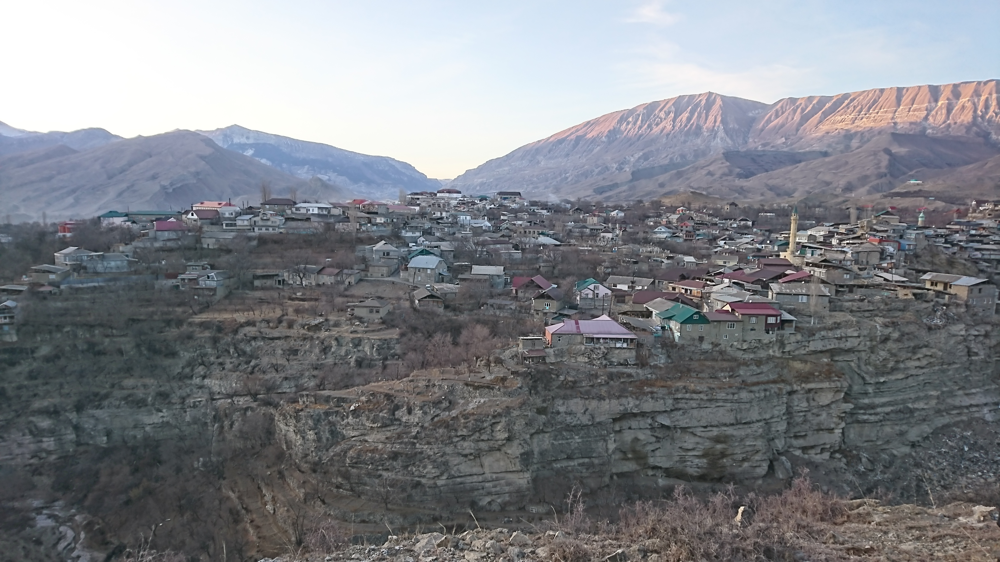

 

В ходе лингвистических исследований в 60-х -- 70-х годах, филологи Т.Е. Гудава и Х.Г. Азаев записали разные сказки и рассказы на ботлихском языке. Эти рассказы были записаны грузиницей (Т.Е. Гудава) и приспособленной аварской кириллицей (Х.Г. Азаев), и были опубликованы в грамматике ботлихского языка Т.Е. Гудавы на грузинском языке (1962), и в кандидатской диссертации Х.Г. Азаева (1974).
 

Цель настоящей страницы -- сделать эти истории доступны ботлихцам.
 

---

Страницу создали Г.А. Мороз, К. Наккарато, и С. Ферхеес из [Международной Лаборатории Языковой Конвергенции](https://ilcl.hse.ru/) при НИУ ВШЭ, Москва. Если хотите с нами связаться - пишите письмо jhverhees _at_ hse.ru.

---

